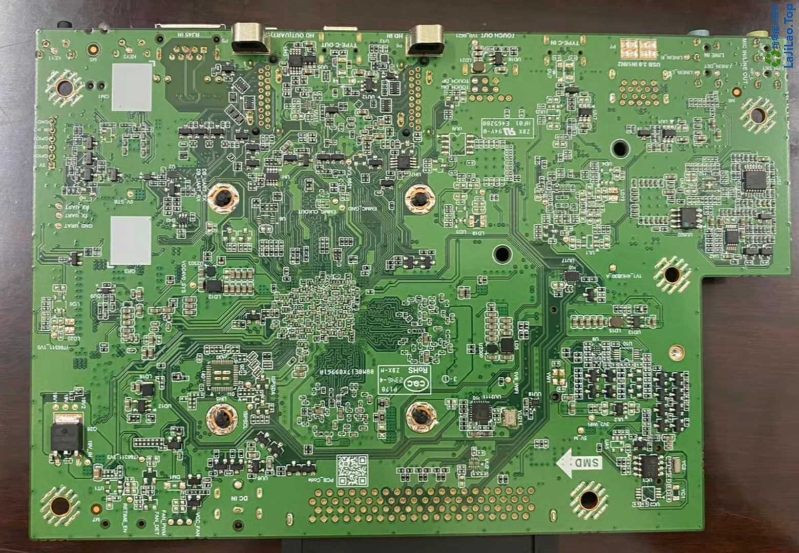
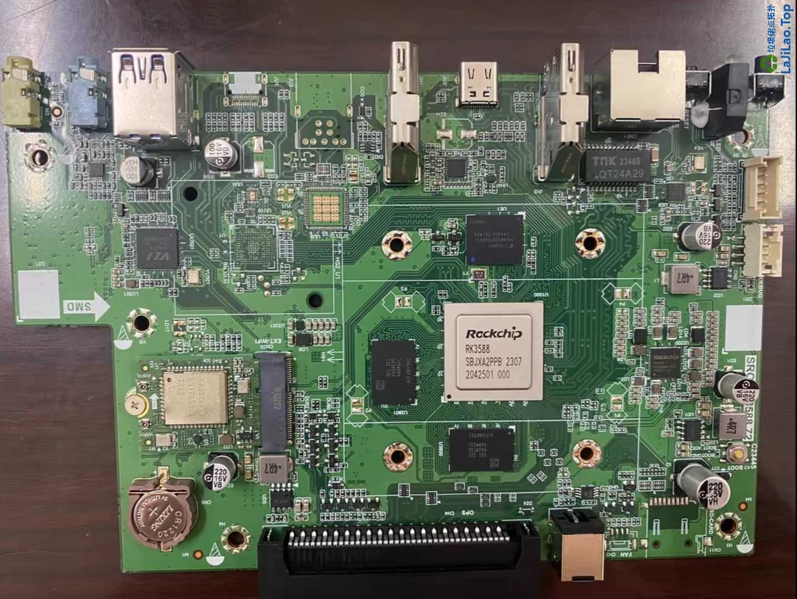
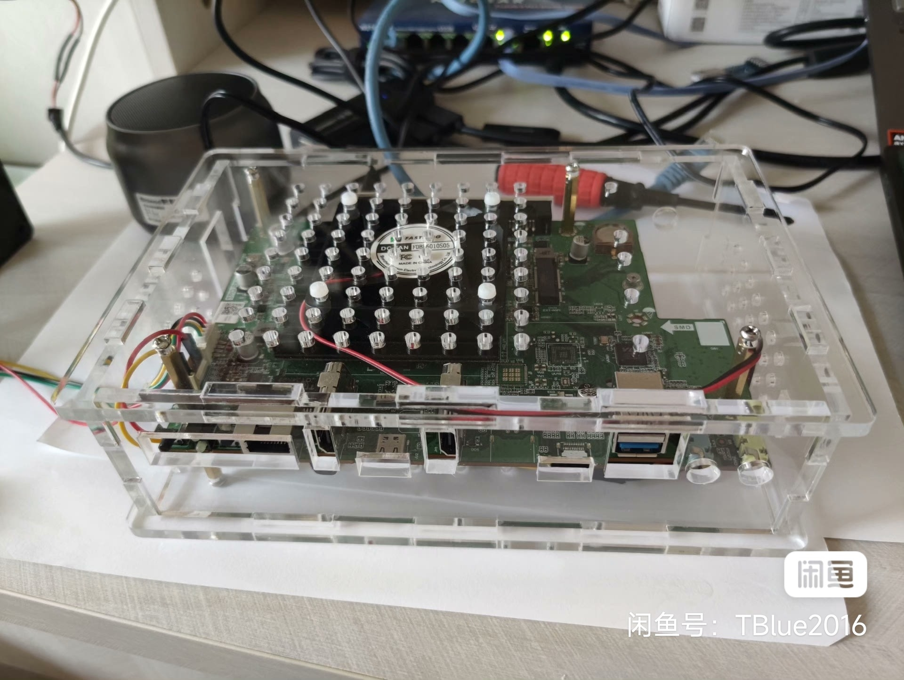
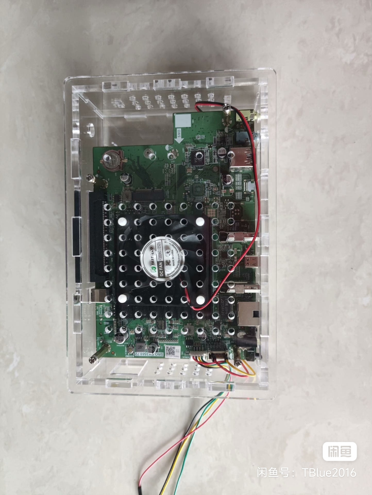
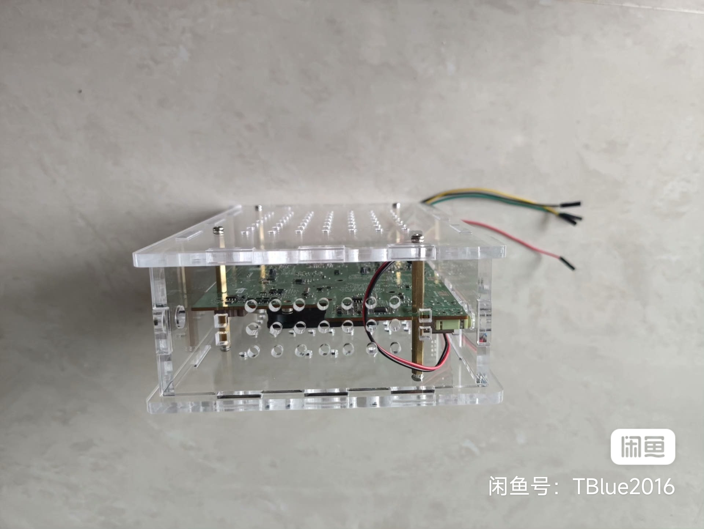
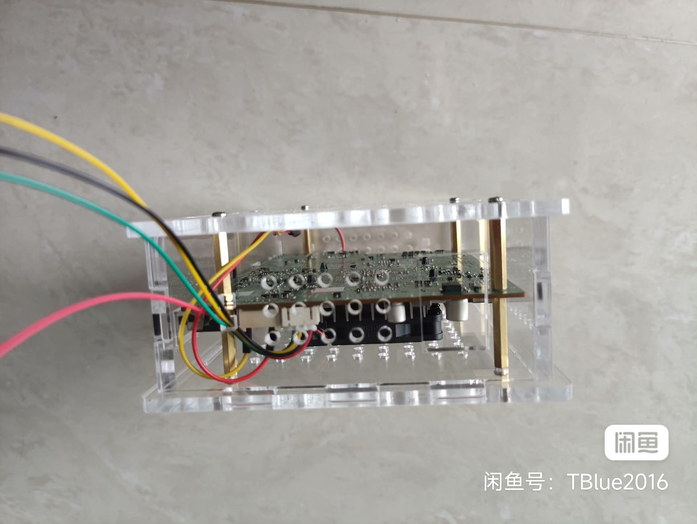
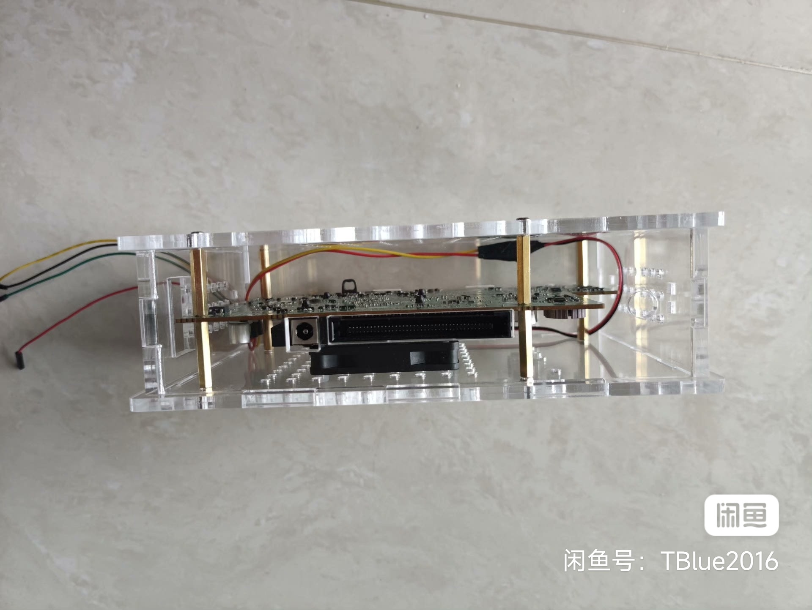
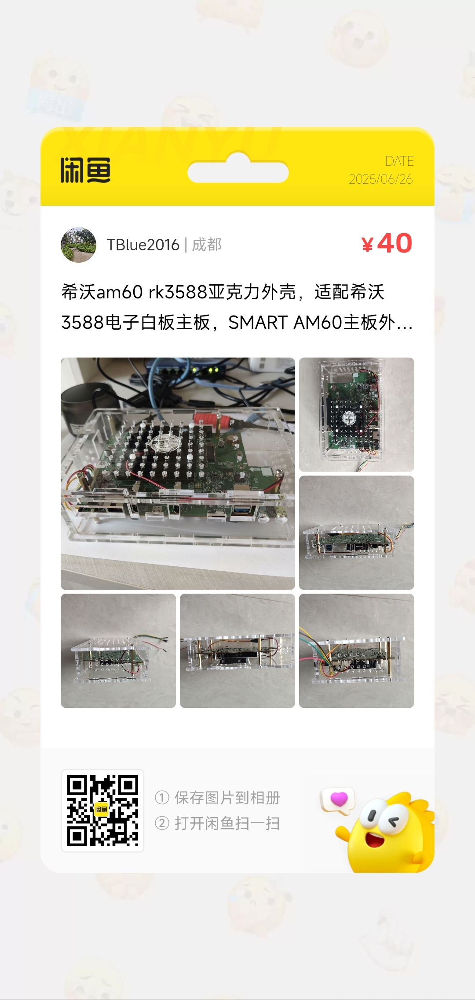

# Smart-Am60 RK3588


```
Something I hope you know before go into the coding~
First, please watch or star this repo, I'll be more happy if you follow me.
Bug report, questions and discussion are welcome, you can post an issue or pull a request.
```

## 相关站点

* 官网介绍: <https://support.smarttech.com/docs/accessories/comp-modules-and-appliances/am60/en/about/about-smart-appliance.cshtml>


## 开发板信息






## 高透亚克力外壳















* 外壳购买方式: 扫描上图二维码，跳转闲鱼购买


希沃am60 rk3588亚克力外壳，适配希沃3588电子白板主板，SMART AM60主板外壳，实物拍摄，带螺丝铜柱，外壳厚度5mm

1. 预留2.5寸硬盘空位
2. 预留nvme 2230 2242 2260 2280 孔位
3. 预留开关孔位
4. 预留5010 6010 风扇孔位
5. 预留boot按钮侧面(手按)孔
6. 预留ttl串口调试线孔位

---